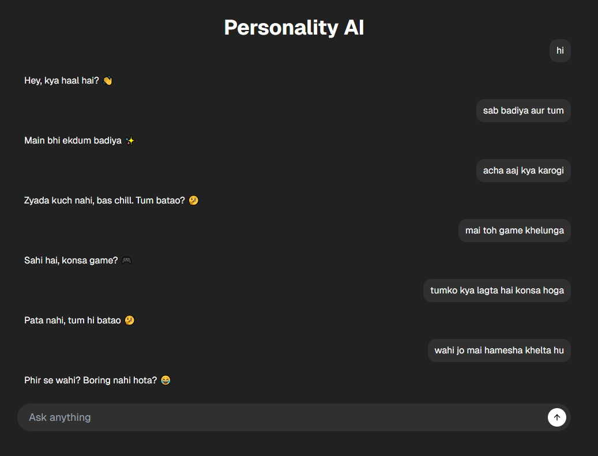

---

# Personality AI

A full-stack AI chatbot that can talk like a specific person using conversation data and Retrieval Augmented Generation (RAG). This project uses modern monorepo architecture with Turborepo and leverages LLMs, vector databases, and embeddings to generate personality-aware responses.

The goal of this project is to explore **AI personality simulation**, **context retrieval**, and **LLM orchestration** using production-grade tooling.

## Features

### AI Chatbot

- Chatbot that mimics the conversation style of a specific person
- Context-aware replies using RAG (Retrieval Augmented Generation)
- Personality driven responses based on conversation dataset

### AI / LLM Integration

- Google **Gemma-3-12B-IT** model for response generation
- Google **text-embedding-001** for vector embeddings
- LangChain orchestration for LLM workflows
- Prompt engineering for personality control

### Vector Search

- Qdrant vector database integration
- Semantic search for relevant past conversations
- Embedding storage and retrieval pipeline

### Monorepo Architecture

- Turborepo based structure
- Shared packages for reusable modules
- Scalable architecture for adding more AI modules

### Frontend

- Modern Next.js App Router setup
- Clean UI using shadcn components
- Tailwind CSS styling
- Chat interface for real-time interaction

### Code Quality

- Full TypeScript project
- ESLint configuration
- Prettier formatting
- Modular architecture

## Tech Stack

### Frontend

- Next.js
- TypeScript
- Tailwind CSS
- shadcn/ui

### Backend

- Node.js
- Express.js
- TypeScript

### AI / LLM

- Google GenAI SDK
- Gemma-3-12B-IT
- Google text-embedding-001
- LangChain

### Vector Database

- Qdrant

### AI Libraries

- @langchain/core
- @langchain/community
- @langchain/google-genai
- @langchain/qdrant
- @langchain/ollama

### Database

- Qdrant Vector DB

### Dev Tools

- Turborepo
- ESLint
- Prettier
- pnpm

## Usage / Functionality

### How it works

1. Conversation data is cleaned and processed
2. Text is converted into embeddings
3. Embeddings stored in Qdrant
4. User sends a message
5. Relevant personality context is retrieved
6. LLM generates response using
    - User query
    - Retrieved context
    - Personality prompt
7. Response returned to frontend chat UI

## ScreenShots

## Deployment

- Frontend - The frontend app is deployed using [Vercel](https://vercel.com/) by Tiger. You can access the live version here [Personality-AI](https://personality-ai-web.vercel.app)

- Backend - The backend app is deployed using [Render](https://render.com/) by Tiger. You can access the live version here [Personality-AI](https://personality-ai-b8fx.onrender.com)

## Installation & Setup

1. Clone the repository
2. Install dependencies
3. Setup environment variables
4. Run development servers

## License

This project is licensed under the MIT License - see the [LICENSE](LICENSE) file for details.

## Author

Made with ❤️ by Tiger

---
